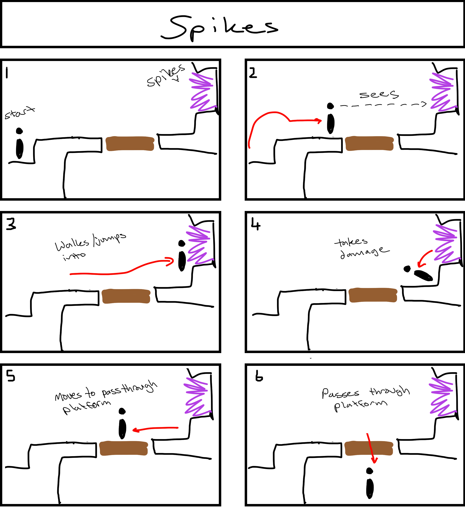

[](https://classroom.github.com/a/YyUO0xtt)
# COMP2150  - Level Design Document
### Name: Evelyn Greener
### Student number: 47695501 

This document discusses and reflects on the design of your platformer level for the Level Design assessment. It should be 1500 words. Make sure you delete this and all other instructional text throughout the document before checking your word count prior to submission. Hint: You can check word count by copying this text into a Word or Google doc.

Your document must include images. To insert an image into your documentation, place it in the "DocImages" folder in this repo, then place the below text where you want the image to appear:

```

```

Example:


## 1. Player Experience (~700 words)
Outline and justify how your level design facilitates the core player experience goals outlined in the assignment spec. Each section should be supported by specific examples and screenshots of your game encounters that highlight design choices made to facilitate that particular experience.

### 1.1. Discovery
What does the player learn? How does your encounter and broader level design facilitate learning in a way that follows good design practice?

I broke my level into roughly three main sections, all designed with learning objectives in mind. The first section is the start, where I start by introducing the player to minor movement challenges, and slowly start adding environmental factors for them to navigate. I started this by adding spikes in a place the player is likely going to see but never going to walk into, before I put them in places the player may actually get hurt by. I also introduced the first checkpoint to the player by having them drop down and fall onto it, so that they won't miss it and will immediately figure out what it is. The first section is only supposed to introduce the player to environment related obstacles, giving them a relatively low stress environment in comparison to later areas. The second area introduces the player to the staff and has chompers for the player to kill, and then later in the second area the player is given a gun to learn against spitters. The last section is mainly to test the players' learning and have them learn to use all skills together. 

### 1.2. Drama
What is the intensity curve? How does your design facilitate increasing yet modulating intensity, with moments of tension and relief? 

The intensity of the level mainly increases throughout the level, with a few notable rest points for the player. The player starts out in a room just off the level to have them drop into the level, the first section relatively low on the intensity level but gradually increasing to the end of the section. There is a rest period as they climb into the dungeon, with no dangers around them as they walk out in the open before climbing up into the dungeon. The player is introduced to the staff, and given some low-stakes challenges before being tested to acquire the key, then is given the gun in a similar manner. Having the player fight enemies here instead of just navigating their environment gives a higher baseline of tension that i chose not to give them in the first section in order for the difficulty curve to increase in a way that made sense. There is only a short break before going into the third section, not giving the player much time to relax before they having to navigate all challenges at once. After this section, there is 2 empty hallways for the player to walk through to decrease the intensity over time before they approach the door, finishing the level. 

### 1.3. Challenge
What are the main challenges? How have you designed and balanced these challenges to control the difficulty curve and keep the player in the flow channel?

The first area is rather enclosed, boxing the player in tight spaces. The player jumps into an underground section after starting in a space they can see out to the skybox behind them. When they finish this section, they climb out into the open air which they saw as they first entered the level, briefly seeing the world around them and the structure of a dungeon above/around them. They get to wander the open for a little, before being able to climb into the dungeon which provides a vastly different space for them to explore- open rooms with flat structure, as opposed to the dirt cave they were in previously. I used an area shift such as this to help create a break in the intensity curve, and give the player a sense of curiosity as they see a new space to explore. The dungeon stays mostly the same, with an edition of a labyrinth at the end with items around it such as health pickups to encourage the player to explore it before they find the end.

As stated in 1.1, I broke out the challenges into three main sections to test the player on certain skills they pick up throughout the level. It helps to space out the challenge instead of having it all presented at once, and clearly gives the player challenges related to the skills they’ve progressed the area with to achieve a better flow. The last area of the level is supposed to challenge the use of movement, staff, and gun skills together, sort of morphing together previous challenges before the player aquires a key throughout earlier sections of the level to finish it off with a higher spike in the difficulty after gradual increase. 

### 1.4. Exploration
How does your level design facilitate autonomy and invite the player to explore? How do your aesthetic and layout choices create distinct and memorable spaces and/or places?

The first area is rather enclosed, boxing the player in tight spaces. The player jumps into an underground section after starting in a space they can see out to the skybox behind them. When they finish this section, they climb out into the open air which they saw as they first entered the level, briefly seeing the world around them and the structure of a dungeon above/around them. They get to wander the open for a little, before being able to climb into the dungeon which provides a vastly different space for them to explore- open rooms with flat structure, as opposed to the dirt cave they were in previously. I used an area shift such as this to help create a break in the intensity curve, and give the player a sense of curiosity as they see a new space to explore. The dungeon stays mostly the same, with an edition of a labyrinth at the end with items around it such as health pickups to encourage the player to explore it before they find the end.


## 2. Core Gameplay (~400 words)
A section on Core Gameplay, where storyboards are used to outline how you introduce the player to each of the required gameplay elements in the first section of the game. Storyboards should follow the format provided in lectures.

Storyboards can be combined when multiple mechanics are introduced within a single encounter. Each section should include a sentence or two to briefly justify why you chose to introduce the mechanic/s to the player in that sequence.

You should restructure the headings below to match the order they appear in your level.

### 2.1. Spikes


I first introduced spikes as an idea to the player just off the path of where they want to go. This introduces the player an idea of environmental factors that could hurt them without actually hurting them first. 

### 2.2. Passthrough Platforms

The first passthrough platform is low stakes, falling onto a checkpoint. This was to get the player deeper into the level, and after the checkpoint theres higher stakes passthrough platforms for the player to choose between to progress further. 

### 2.3. Checkpoints

I put a first checkpoint after the first initial spike, to tell the player they can save their progress after they learn that they can get damaged by the environment.

### 2.4. Acid

One of the passthrough platforms will drop onto acid if the player cannot act quickly. The player will also be able to see this acid even if they dropped through the safe platform, to warn the player before it becomes a greater threat with the parkour. 

### 2.5. Health Pickups

The first health pickup is just after the passthrough platform with the acid, in case the player chose the wrong platform- giving them space to make a mistake and have a learning opportunity. 

### 2.6. Moving Platforms

The first moving platform is over a gap, where the player simply has to walk on and jump up off the platform. This is low stakes, compared to the parkour section with platforms as they get higher. 

### 2.7. Keys

The first key is in a little enclave with spikes to give the player some risk. I hoped the spikes will tell the player this item they see above them is important, and will challenge themself to pick it up. 

### 2.8. Weapon Pickup (Staff)

The staff is the first item the player sees and picks up when they reach the dungeon, only given after the player crawled out of the cave. 

### 2.9. Chompers

The first chomper is right in front of a breakable column, in front of the staff pick up. I did this so the column will keep the chomper away from the player, and the player will accidentally break the column when they try to attack the chomper, telling the player they can break columns to move past them. 

### 2.10. Weapon Pickup (Gun)

The gun is after a few chomper and staff related challenges, so the player tries some close combat before they get the gun. Having the staff beforehand also gives the player a second option to use their staff if the spitter gets too close to the player. 

### 2.11. Spitters

Spitters are more difficult than chompers, so I only introduced them after the chompers as their spit does tend to clip through the floor and hurt the player which provides an extra level of complexity to the dungeon, so it made the most sense to put them as the last encounter in the level. 


## 3. Spatiotemporal Design
A section on Spatiotemporal Design, which includes your molecule diagram and annotated level maps (one for each main section of your level). These diagrams may be made digitally or by hand, but must not be created from screenshots of your game. The annotated level maps should show the structure you intend to build, included game elements, and the path the player is expected to take through the level. Examples of these diagrams are included in the level design lectures.

No additional words are necessary for this section (any words should only be within your images/diagrams).
 
### 3.1. Molecule Diagram


### 3.2. Level Map – Section 1


### 3.3.	Level Map – Section 2


### 3.4.	Level Map – Section 3


## 4. Iterative Design (~400 words)
Reflect on how iterative design helped to improve your level. Additional prototypes and design artefacts should be included to demonstrate that you followed an iterative design process (e.g. pictures of paper prototypes, early grey-boxed maps, additional storyboards of later gameplay sequences, etc.). You can also use this section to justify design changes made in Unity after you drew your level design maps shown in section 3. 

You should conclude by highlighting a specific example of an encounter, or another aspect of your level design, that could be improved through further iterative design.

My level design underwent a few changes, this being the first rough design on paper. 

This first design on paper had a similar structure, but a different design. The tunnels had a roughly similar shape, but underwent a few changes to get to the final draft, and the same is to be said about the dungeon layers. I originally had the exit door in the centre of the level, so the player could catch a glimpse of it as they passed, however I later moved it to the top right side of the level to balance out section two and three better. I scrapped this design because it wasn't really designed with dramatic pacing in mind, and flowed rather poorly compared to my final design. The initial design also had rather large spaces which would be rather difficult for Ellen to see around in as to where to go or collect items. Making smaller and more deliberate spaces allowed me to have better control over a longer dramatic arc over time, and in roughly the same amount of space create a longer level for the player to complete. 

I then later changed it, and this is the final map i settled on which I used in designing and also the annotated level maps. 


When I also initially began creating the level with the tilemap, I accidently made the level far too large and got about 1/3 of the way in before I playtested it, realising that Ellen couldn't see most of the map around her or jump high enough for areas and challenges. I scrapped this, and remade it to be on a smaller scale so the player can have better control over their movements by extension of actually being able to see where they’re going. Doing so forced me to make small changes to the very start of the level to speed up the progress where Ellen learns jumping movements, where the collision tiles are a lot more refined than shown in the annotated level maps and there were a few less challenges for her to face so the level didnt drag too far to the right, which is something I didn’t really want. 


## Generative AI Use Acknowledgement

Use the below table to indicate any Generative AI or writing assistance tools used in creating your document. Please be honest and thorough in your reporting, as this will allow us to give you the marks you have earnt. Place any drafts or other evidence inside this repository. This form and related evidence do not count to your word count.
An example has been included. Please replace this with any actual tools, and add more as necessary.

N/A
No AI tools were used. 


